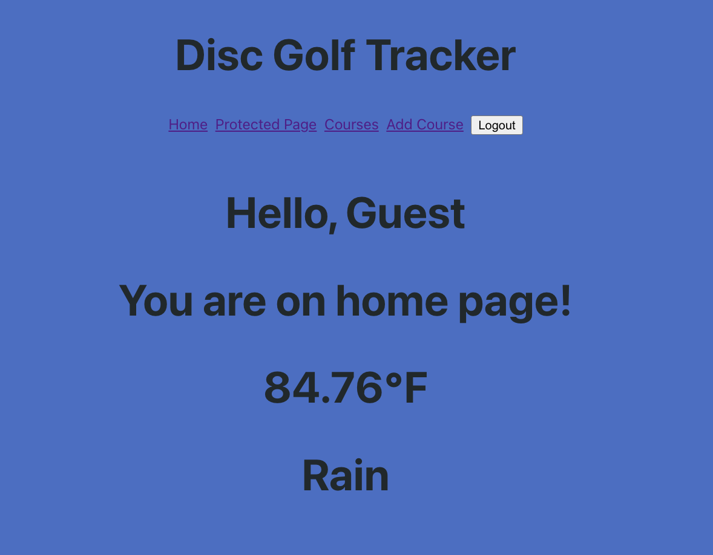
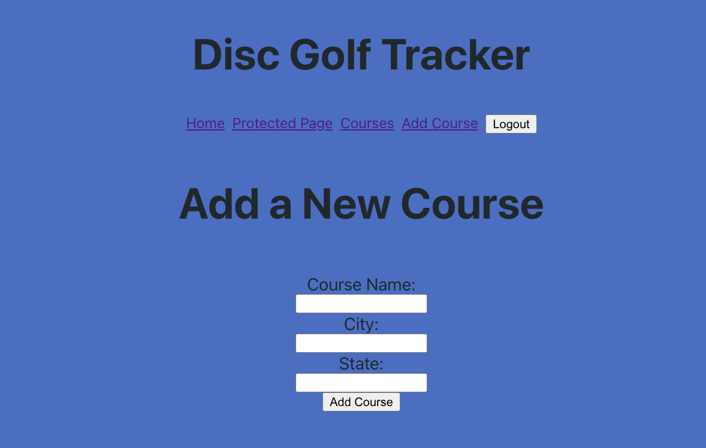

# Disc Golf Tracker

## Background Info 

This app was created as Project 4 in the General Assembly Software Engineering Bootcamp. During the week it took to put together the MVP, the app's design changed multiple times through the learning and struggles with the use of new technologies, but the idea of the finished product remains and will not remain merely an idea for long.

## Description

Disc Golf is an outdoor recreational sport mirroring the more commonly known sport of golf, only played by throwing small frisbees instead of hitting balls with clubs.

One of the most fun things about the game is trying new courses. Courses can be designed in many different ways, with barriers and obstacles, either natural or man-made, or in a completely open field. This app hopes to allow users to add courses to the database and allow all other users to read about them all, hopefully enticing them to try a new course!

---
# Screenshots

Landing Page

Add A Course Page

---
# Technologies Used

1. Django/Django Rest Framework
2. React
3. Open Weather API

---
# Known Bugs

1. Weather API location is hard-coded. Dynamically updated lat/lon was inaccurate.
2. Course Detail Page does not render Course Details.

---
# Future Features

1. Players will be able to reserve tee times at courses.
2. Club feature, where players can join a club and plan events.
3. Player stat tracking.
4. Weather API will be used to provide weather info based on course location
